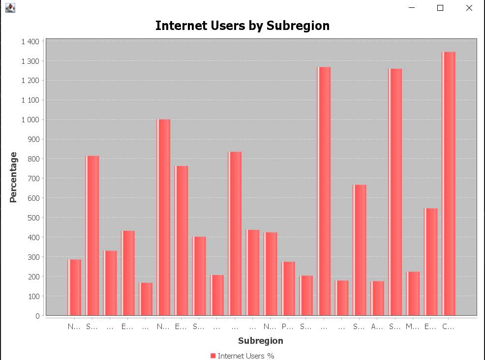
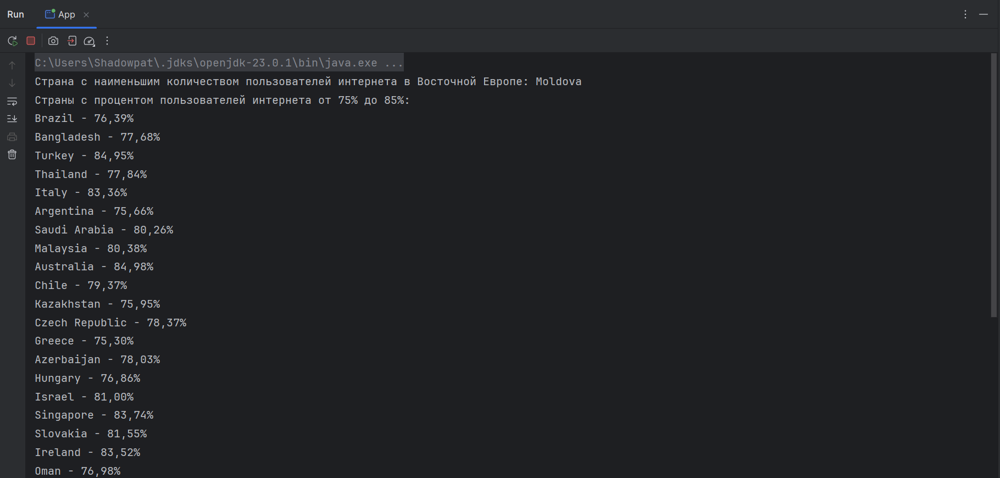
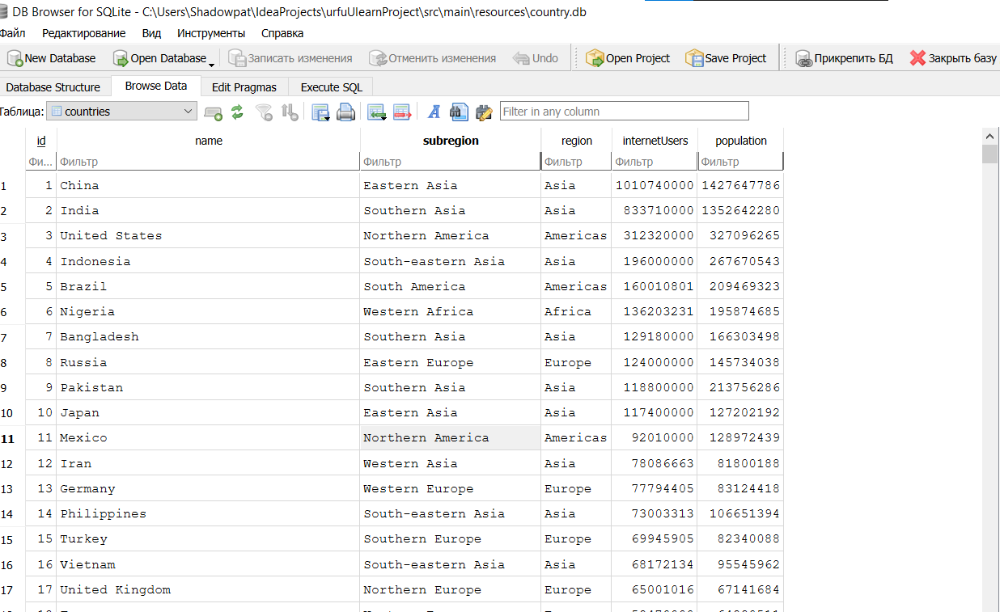

# Java Ulearn Project 

### Джобиров Владимир Джамшедович, РИ-230914

---

## О проекте

**CountryAnalysis** — это проект на языке Java, целью которого является:
1. Построение графика процентного соотношения пользователей интернета от всего населения по субрегионам.
2. Вывод страны с наименьшим количеством зарегистрированных пользователей интернета в субрегионе Восточной Европы.
3. Вывод списка стран, где процент пользователей интернета находится в диапазоне от 75% до 85%.

Данные для анализа берутся из файла `Country.csv`, а результаты сохраняются в базу данных SQLite и визуализируются с использованием библиотеки JFreeChart.

---

## Структура проекта

```text
CountryAnalysis
├── src
│   ├── main
│   │   ├── java
│   │   │   └── org
│   │   │       └── example
│   │   │           ├── model
│   │   │           │   └── Country.java
│   │   │           ├── database
│   │   │           │   └── DatabaseHandler.java
│   │   │           ├── parser
│   │   │           │   └── CountryDataParser.java
│   │   │           ├── visualization
│   │   │           │   └── ChartBuilder.java
│   │   │           └── App.java
│   │   └── resources
│   │       └── Country.csv
│   └── test
│       └── java
├── pom.xml

```


---

## Технологии

- **Java 17** — основной язык разработки.
- **Maven** — управление зависимостями и сборкой проекта.
- **SQLite** — база данных для хранения данных.
- **OpenCSV** — библиотека для работы с CSV-файлами.
- **JFreeChart** — построение графиков и диаграмм.

---

## Последовательность выполнения

1. **Подготовка данных:**
    - Скачан CSV-файл `Country.csv` с данными о населении и интернет-пользователях.
    - Проверена корректность данных и их форматирование.

2. **Реализация проекта:**
    - **Модель данных:** создан класс `Country` для хранения информации о стране.
    - **Парсинг CSV:** реализован класс `CountryDataParser` для чтения и обработки данных из CSV.
    - **База данных:** создана структура таблицы SQLite и реализованы методы для сохранения данных.
    - **Анализ данных:** с использованием Java Stream API выполнены запросы для поиска нужных данных.
    - **Визуализация:** построен график с использованием JFreeChart.

3. **Результаты:**
    - Построен график процентного соотношения пользователей интернета от населения по субрегионам:
      *(Скриншот 1)*
    - Найдена страна с минимальным количеством пользователей интернета в Восточной Европе:
      *(Скриншот 2)*

---


## Скриншоты

1. **График стран**

   

2. **Процентное соотношение пользователей интернета**

   
3. **База данных** 



---

## Запуск проекта

1. Клонировать репозиторий:
```aiignore
git clone https://github.com/https://github.com/Shadowpat42/JavaUlearnProject
```
2. Перейти в директорию проекта:

3. Собрать проект с помощью Maven:
```aiignore
mvn clean install
```

4. Запустить проект:

---

## Автор

Джобиров Владимир Джамшедович, РИ-230914
